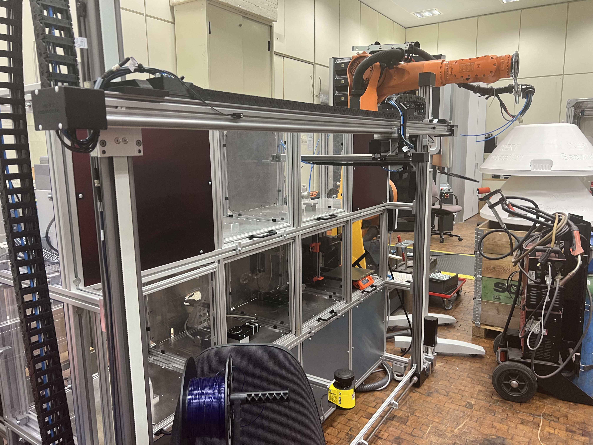

# Automated Modular 3D Printing Farm with Product Dispensing
Create an automated 3D printing farm with modular printers that dispense finished products.

# Related Works
## 3D Printer Farm - Robot-based Automation
Technikum Digital Factory at the Fachhochschule Technikum Wien.

<iframe width="560" height="315" src="https://www.youtube.com/embed/EK57AHT1Xqk?si=HaMc4QVCozvwBd3g" title="YouTube video player" frameborder="0" allow="accelerometer; autoplay; clipboard-write; encrypted-media; gyroscope; picture-in-picture; web-share" allowfullscreen></iframe>

## Voodoo Manufacturing triples 3D printing production with Universal Robots

<iframe width="560" height="315" src="https://www.youtube.com/embed/qo_rtzEI_7Y?si=vljhj8MF0Ubtgw81" title="YouTube video player" frameborder="0" allow="accelerometer; autoplay; clipboard-write; encrypted-media; gyroscope; picture-in-picture; web-share" allowfullscreen></iframe>

## PRUSA PRO AFS - Automated Farm System: Presenting the Future of Manufacturing on EXPO 2020 in Dubai

<iframe width="560" height="315" src="https://www.youtube.com/embed/uLMRAC2zJJA?si=qkoUONVfIluHkT8M" title="YouTube video player" frameborder="0" allow="accelerometer; autoplay; clipboard-write; encrypted-media; gyroscope; picture-in-picture; web-share" allowfullscreen></iframe>

## Formlabs Form Cell - SLA Print Farm

<iframe width="560" height="315" src="https://www.youtube.com/embed/LvOdZ6FC-1E?si=w9Ja43ouGB71cQw9" title="YouTube video player" frameborder="0" allow="accelerometer; autoplay; clipboard-write; encrypted-media; gyroscope; picture-in-picture; web-share" allowfullscreen></iframe>

# Working Logs
## Previous work at Helmut-Schmidt-Universität - Universität der Bundeswehr Hamburg

*Small Machine Tools for Small Workpieces (SPP1476) with cartesian coordinate robot*

## Building a 3D Printer

### Morphological Box

| Parameter     | 1         | 2       | 3      |
|---------------|-----------|---------|--------|
| Printer-adbau | Cartesian | Delta   | Polar  |
| Firmware      | Marlin    | Klipper | RepRap |

